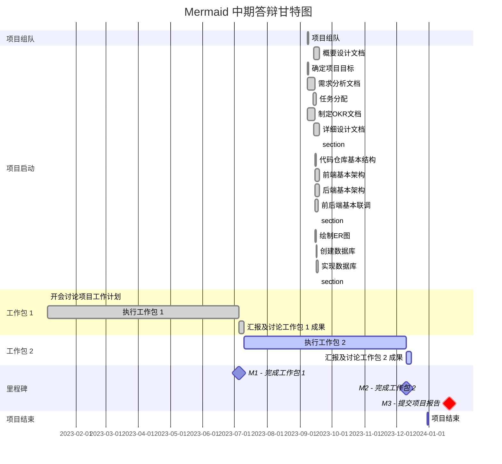

```mermaid
gantt

	title Mermaid 中期答辩甘特图
	%% 起止日期语法格式
   	dateFormat  YYYY-MM-DD
   	%% 最下方时间轴日期格式
	axisFormat %Y-%m-%d
	%% 表示今天标记的显示样式
	todayMarker stroke-width:3px,stroke:#FBBC05,opacity:0.6

	%% 定义任务分类/区
	section 项目组队
	项目组队: done,a0,2023/09/08,1d

	section 项目启动
	概要设计文档: done,2023/09/14,5d
	确定项目目标: done ,2023/09/08,1d
	需求分析文档: done , 2023/09/08, 7d
	任务分配 : done, 2023/09/13,3d
	制定OKR文档: done, 2023/09/08, 7d
	详细设计文档: done, 2023/09/14, 5d

	section: 确定工作流
	代码仓库基本结构: done, 2023/09/15, 1d
	前端基本架构: done, 2023/09/15, 4d
	后端基本架构: done, 2023/09/15,4d
	前后端基本联调: done, 2023/09/15, 3d

	section: 数据库设计
	绘制ER图: done, 2023/09/15,1d
	创建数据库: done, 2023/09/16,1d
	实现数据库: done,2023/09/16,2d

	section: 前端开发
	
	
	section 工作包 1
	开会讨论项目工作计划: done, a1, after a0, 2023-01-05
	执行工作包 1: done, a2, after a1, 6M
	汇报及讨论工作包 1 成果: done, a3, after a2, 5d

    section 工作包 2
    执行工作包 2: active, a4, after a3, 5M
	汇报及讨论工作包 2 成果: active, a5, after a4, 5d
    
    section 里程碑
	M1 - 完成工作包 1: milestone, after a2, 0d
	M2 - 完成工作包 2: milestone, after a4, 0d
	M3 - 提交项目报告: crit, milestone, 2024-01-20, 0d
	
	section 项目结束
	项目结束: active, 2023-12-30, 1d
```

