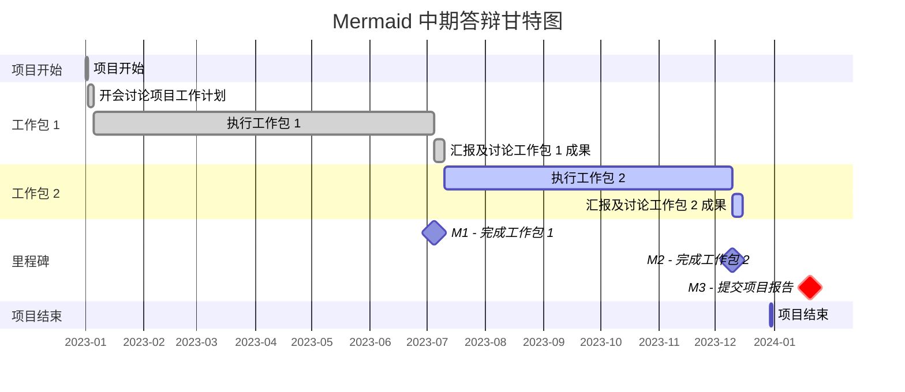

```mermaid
gantt

	title Mermaid 中期答辩甘特图

	%% 起止日期语法格式
   	dateFormat  YYYY-MM-DD
   	%% 最下方时间轴日期格式
	axisFormat %Y-%m
	%% 最下方时间轴时间间隔
	tickInterval 1month
	%% 表示今天标记的显示样式
	todayMarker stroke-width:3px,stroke:#FBBC05,opacity:0.6

	%% 定义任务分类/区
	section 项目开始
	项目开始: done, a0, 2023-01-01, 1d
	
	section 工作包 1
	开会讨论项目工作计划: done, a1, after a0, 2023-01-05
	执行工作包 1: done, a2, after a1, 6M
	汇报及讨论工作包 1 成果: done, a3, after a2, 5d

    section 工作包 2
    执行工作包 2: active, a4, after a3, 5M
	汇报及讨论工作包 2 成果: active, a5, after a4, 5d
    
    section 里程碑
	M1 - 完成工作包 1: milestone, after a2, 0d
	M2 - 完成工作包 2: milestone, after a4, 0d
	M3 - 提交项目报告: crit, milestone, 2024-01-20, 0d
	
	section 项目结束
	项目结束: active, 2023-12-30, 1d
```
