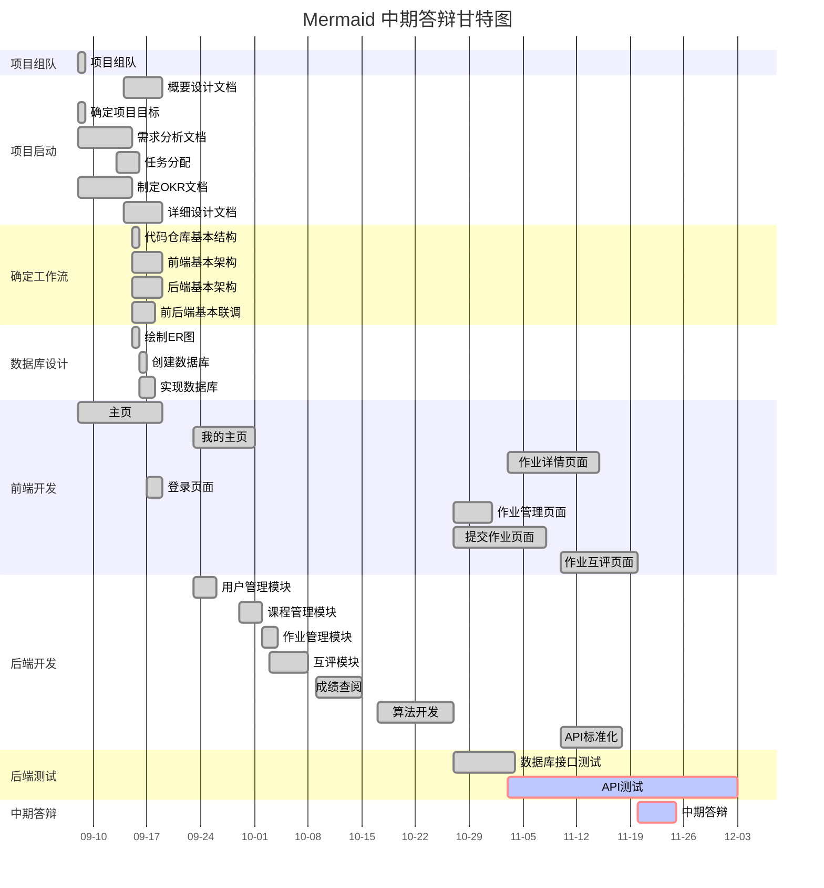
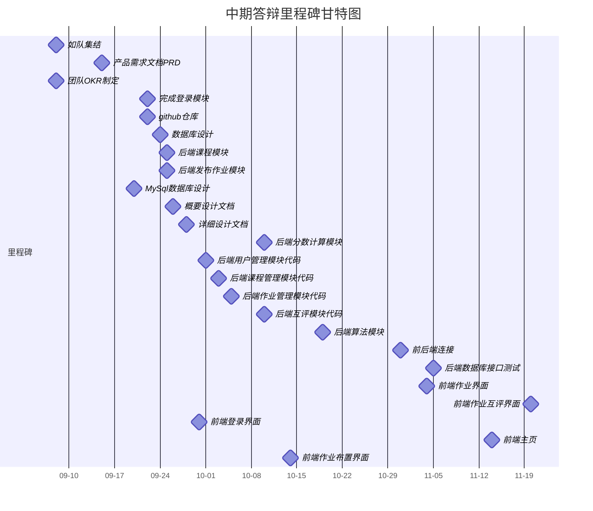

```mermaid
gantt

	title Mermaid 中期答辩甘特图
	%% 起止日期语法格式
   	dateFormat  MM-DD
   	%% 最下方时间轴日期格式
	axisFormat %m-%d
	%% 表示今天标记的显示样式
	todayMarker stroke-width:3px,stroke:#FBBC05,opacity:0.6

	%% 定义任务分类/区
	section 项目组队
	项目组队: done,a0,2023/09/08,1d

	section 项目启动
	概要设计文档: done,2023/09/14,5d
	确定项目目标: done ,2023/09/08,1d
	需求分析文档: done , 2023/09/08, 7d
	任务分配 : done, 2023/09/13,3d
	制定OKR文档: done, 2023/09/08, 7d
	详细设计文档: done, 2023/09/14, 5d

	section 确定工作流
	代码仓库基本结构: done, 2023/09/15, 1d
	前端基本架构: done, 2023/09/15, 4d
	后端基本架构: done, 2023/09/15,4d
	前后端基本联调: done, 2023/09/15, 3d

	section 数据库设计
	绘制ER图: done, 2023/09/15,1d
	创建数据库: done, 2023/09/16,1d
	实现数据库: done,2023/09/16,2d

	section 前端开发
	主页: done,2023/09/08,11d
	我的主页:done,2023/09/23,8d
	作业详情页面:done,2023/11/03,12d
	登录页面: done,2023/09/17,2d
	作业管理页面: done,2023/10/27,5d
	提交作业页面: done,2023/10/27,12d
	作业互评页面: done, 2023/11/10,10d

	section 后端开发
	用户管理模块: done,2023/09/23,3d
	课程管理模块: done,2023/09/29,3d
	作业管理模块: done,2023/10/2,2d
	互评模块: done,2023/10/03,5d
	成绩查阅: done,2023/10/09,6d
	算法开发: done,2023/10/17,10d
	API标准化: done,2023/11/10,8d

	section 后端测试
	数据库接口测试: done,2023/10/27,8d
	API测试: crit,active, 2023/11/03,30d

	section 中期答辩
	中期答辩: crit,active,2023/11/20,5d
```

```mermaid
gantt

	title 中期答辩里程碑甘特图
	%% 起止日期语法格式
   	dateFormat  MM-DD
   	%% 最下方时间轴日期格式
	axisFormat %m-%d
	%% 表示今天标记的显示样式
	todayMarker stroke-width:3px,stroke:#FBBC05,opacity:0.6

section 里程碑
	如队集结: milestone,2023/09/08,0d
	产品需求文档PRD: milestone,2023/09/15,0d
	团队OKR制定: milestone,2023/09/08,0d
	完成登录模块: milestone,2023/09/22,0d
	github仓库: milestone,2023/09/22,0d
	数据库设计: milestone,2023/09/24,0d
	后端课程模块: milestone,2023/09/25,0d
	后端发布作业模块: milestone,2023/09/25,0d
	MySql数据库设计: milestone,2023/09/20,0d
	概要设计文档: milestone,2023/09/26,0d
	详细设计文档: milestone,2023/09/28,0d
	后端分数计算模块: milestone,2023/10/10,0d
	后端用户管理模块代码:milestone,2023/10/01,0d
	后端课程管理模块代码:milestone,2023/10/03,0d
	后端作业管理模块代码:milestone,2023/10/05,0d
	后端互评模块代码: milestone,2023/10/10,0d
	后端算法模块: milestone,2023/10/19,0d
	前后端连接: milestone,2023/10/31,0d
	后端数据库接口测试: milestone,2023/11/5,0d
	前端作业界面: milestone,2023/11/04,0d
	前端作业互评界面: milestone,2023/11/20,0d
	前端登录界面: milestone,2023/9/30,0d	
	前端主页: milestone,2023/11/14,0d
	前端作业布置界面: milestone,2023/10/14,0d	

```

