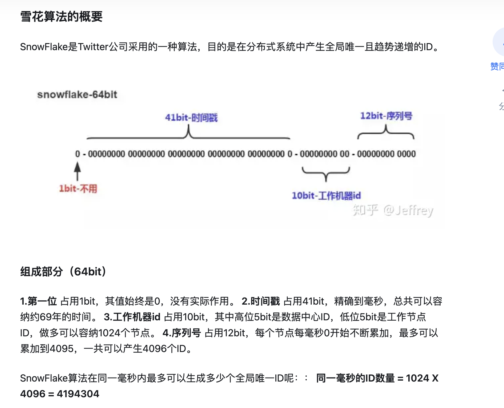

# 标准方法

## List方法

鼓励使用过滤,只返回用户关注的结果,降低带宽和计算

一般都是用string来传递

## Post方法

创建东西一般使用post,创建时最好由服务端生成标识符UID

ID由谁来生成?如何保证全局唯一?

一致性:比如等待支付结果,为了保证用户的结果强一致性,所以要有个loading

- 数据库自增ID
- uuid
- 雪花算法
- 号段模式:一次生成多个id发给用户让他消费

## Delete方法

