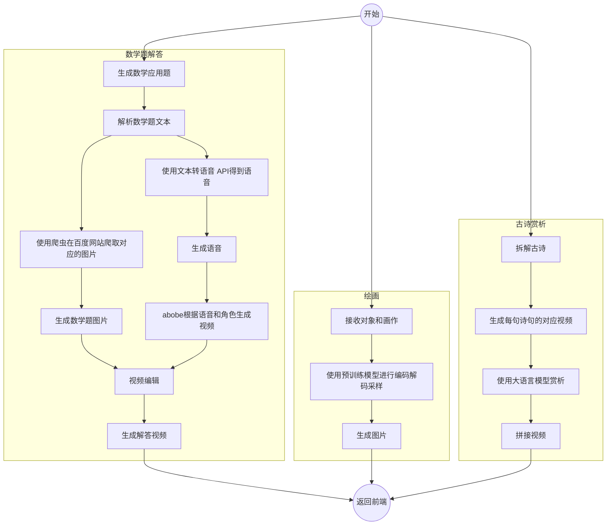

# Shell

```mermaid
graph TD;
    根节点((开始)) --> A;
    根节点 --> I;
    根节点 --> M;

   subgraph 数学题解答
        A[生成数学应用题] --> B[解析数学题文本];
        B --> C[使用爬虫在百度网站爬取对应的图片];
        B --> D[使用文本转语音 API得到语音];
        C --> E[生成数学题图片];
        D --> F[生成语音];
        F-->KK[abobe根据语音和角色生成视频]
        E --> G[视频编辑];
        KK --> G;
        G --> H[生成解答视频];
    end

    subgraph 绘画
        I[接收对象和画作];
        I --> J[使用预训练模型进行编码解码采样];
        J --> K[生成图片];
    end

    subgraph 古诗赏析
        M[拆解古诗];
        M --> N[生成每句诗句的对应视频];
        N --> O[使用大语言模型赏析];
        O --> P[拼接视频];
    end
    H-->EN
    K-->EN
    P-->EN
    EN((返回前端))

```

